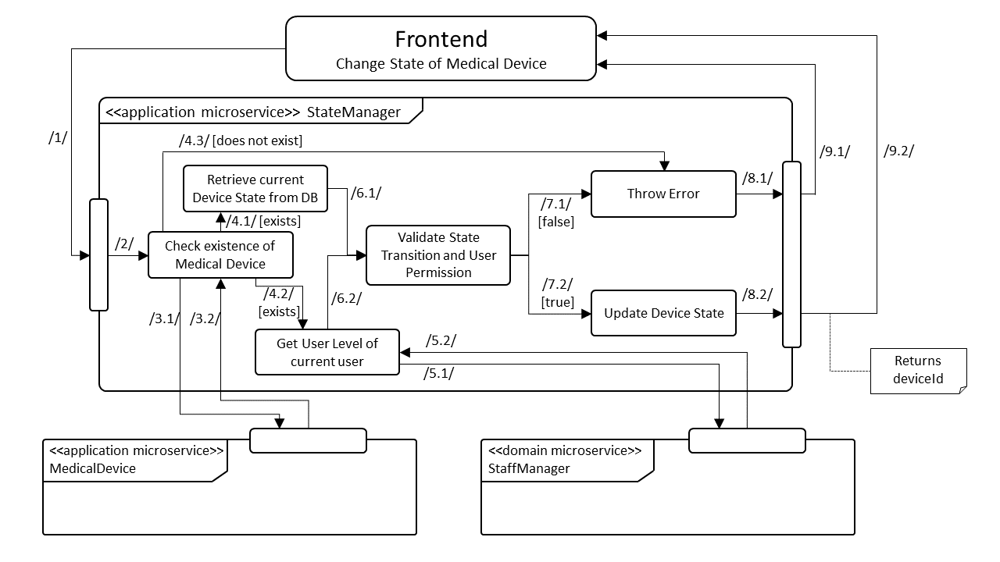

# Task Processes

## Add Initial State to Medical Device

## Remove State of Medical Device

## Delete History of Medical Device

## Change State of Medical Device

## Report Defect of Medical Device

## Set Defect Priority of Medical Device

## Set Availability Date of Medical Device

## Get State of Medical Device
